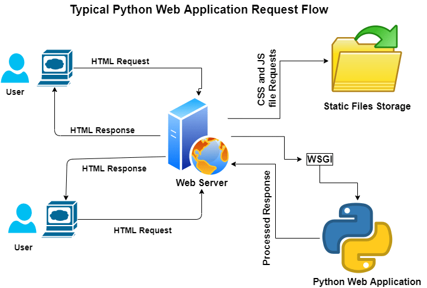

# Carona_cases_Tracking

## Overview

This project walks through how you can create a simple webapplication  using Python  Flask and DataVisualization .  
## Quick start

The overall architecture looks like this:

The technologies used in this demo are:

**Core components (Web Application)**

 - Python flask application
 - Pygal Library
 - Heroku 
    
## Data Source 
https://ourworldindata.org/

## Deployed Project Link
 https://covid-data-visualizing.herokuapp.com/
